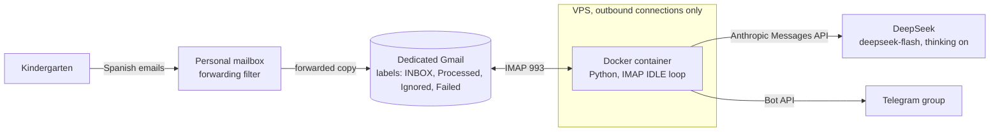
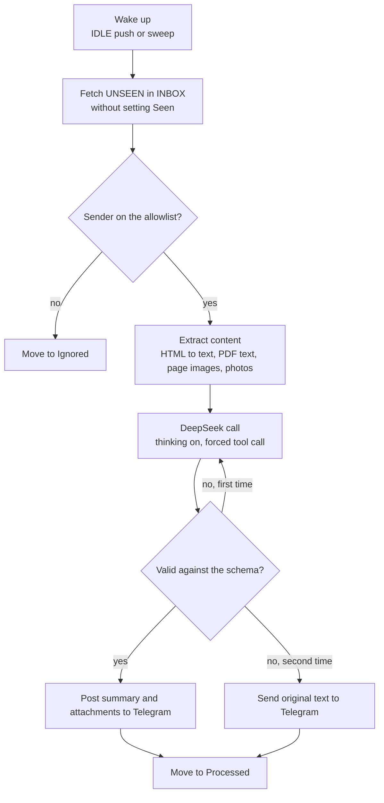
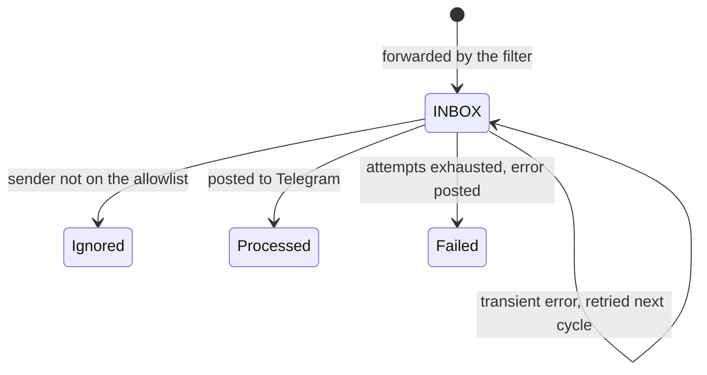

# Architecture

This is the reference for building the tool and for changing it later. The reasons behind each decision are in section 14.

## Status

Project scaffold, 2026-10-05. Done: configuration, packaging, Docker files, the output schema and the system prompt. Not done: the IMAP loop, content extraction, the model call and the Telegram client. These modules are stubs.

## 1. Purpose and constraints

The kindergarten sends emails in Spanish almost every day. Most are routine, some are urgent, some carry deadlines. The owner rarely reads email and wants every message turned into a short Russian summary with labels, delivered to a private Telegram group.

Constraints that shaped the design:

- The tool must not have access to the owner's personal mailbox.
- Only emails from an allowlist of kindergarten senders are processed.
- Python. Simple and cheap: one container on a VPS, no database, no extra services.
- Model: DeepSeek `deepseek-flash` with thinking enabled.

## 2. System overview



The container makes outbound connections only: IMAP to Gmail, HTTPS to DeepSeek and Telegram. Nothing listens on a port.

## 3. Components

| Component | Responsibility | Where |
|---|---|---|
| Personal mailbox | One filter forwards mail from the kindergarten senders to the dedicated account | Owner's mail provider |
| Dedicated Gmail | Receives forwarded mail. Its labels are the only state (section 6) | Google, app password over IMAP |
| App container | Long-running Python process: IDLE loop, extraction, model call, Telegram | `src/kindergarten_email_checker/` |
| DeepSeek | Summarization, through the Anthropic Messages API format | `api.deepseek.com/anthropic` |
| Telegram Bot API | Delivery to the private group | `api.telegram.org` |

Module map:

| Module | Role |
|---|---|
| `main.py` | Entry point and the wake, fetch, process, move loop |
| `config.py` | Settings from environment variables, allowlist matching |
| `mail.py` | IMAP session, IDLE wait, fetching unseen mail, moving between labels |
| `content.py` | HTML to text, PDF text extraction, rendering scanned pages, size caps |
| `summarize.py` | Output schema, tool definition, the model call, validation and retry |
| `telegram.py` | Message formatting, sendMessage, error posts |
| `prompt.md` | System prompt |

## 4. Runtime loop

1. On start: connect to IMAP, create the state labels if missing, process everything unseen.
2. Forever: issue IMAP IDLE and wait up to `SWEEP_MINUTES`. Return on new mail or on timeout. Process everything unseen. Repeat.
3. The sweep after a timeout catches anything IDLE missed and refreshes the session, which Gmail drops after roughly 30 minutes anyway.
4. On any IMAP error: log, wait 30 seconds, reconnect. The loop never exits on its own. Docker restarts the process if it crashes.
5. Socket timeouts on IMAP and HTTP calls, so a stalled connection cannot block the loop.

Plain polling is the same loop without the IDLE call. It is the fallback if IDLE misbehaves with Gmail.

## 5. Processing one email



1. Allowlist: the From address is compared with `ALLOWED_SENDERS`, exact address or `@domain` suffix, case-insensitive. Gmail forwarding keeps the From header intact. A non-matching sender is moved to `Ignored` with no notification.
2. Extraction: section 7.
3. Model call: section 8.
4. Telegram: section 9.
5. Move to `Processed`. This is the commit point.

## 6. State model



- Unseen mail in `INBOX` is the queue. Fetching uses `mark_seen=False`; moving the message is the only state change the tool makes.
- Telegram is called before the move. A crash between the two produces one duplicate message, never a lost one.
- A per-UID attempt counter lives in memory. After `MAX_RETRIES_PER_MESSAGE` failures the message is moved to `Failed` and the error is posted once. The counter resets on restart, which only grants a few extra attempts.
- No database. Everything the tool knows is visible in the Gmail web UI, which doubles as the admin interface.

## 7. Content extraction

| Input | Handling | Reaches the model as |
|---|---|---|
| HTML body | Prefer the text/plain part when present, otherwise html2text | text |
| PDF with a text layer | pypdf `extract_text`. A text layer counts as present when the average page has more than ~200 characters | text |
| PDF without a text layer | pypdfium2 renders each page to PNG at about 110 dpi, at most 10 pages | images |
| JPEG, PNG, GIF, WebP | As is. Images under 20 KB are skipped as logos and signature graphics | images |
| Other files | Not sent to the model. The file names are listed in the prompt | nothing |

Caps: attachments above `MAX_ATTACHMENT_MB` are not sent to the model; the request body stays under DeepSeek's 48 MiB limit; body text is truncated at about 40,000 characters with a note.

Attachment files are not sent to Telegram. The post lists the attachment names, except skipped small images.

## 8. The model call

- Endpoint: the Anthropic Messages API format served by DeepSeek at `https://api.deepseek.com/anthropic`, called with the `anthropic` SDK and a custom `base_url`. Switching to a Claude model later is a base URL and model change.
- Model: `deepseek-flash` (DeepSeek-V4.1-Flash). Cheapest, accepts images, recommended by DeepSeek. `deepseek-v4-pro` is text-only.
- Thinking: enabled. The request carries `thinking={"type": "enabled", "budget_tokens": 8000}`; DeepSeek ignores `budget_tokens` and reads the effort from `output_config={"effort": LLM_EFFORT}`. The response's thinking blocks are ignored. Every call is single-turn, so nothing is passed back.
- Output shaping: one tool, `report_summary`, whose `input_schema` is `Summary.model_json_schema()`, requested with `tool_choice={"type": "tool", "name": "report_summary"}`. DeepSeek's Anthropic format has no structured-output mode and no JSON mode, so the tool call is how the schema is enforced.
- Validation: `Summary.model_validate(tool_use.input)`. On a validation error or a missing tool call: one retry with the error text appended as a user message. After two failures: subject, sender and original text go to Telegram without a summary, and the email is still moved to `Processed`.
- Inputs: the system prompt from `prompt.md`; a user message with a metadata block (From, Subject, sent date in America/Argentina/Buenos_Aires, today's date), the body text, the PDF texts, the list of files not sent to the model, and the image blocks.
- `max_tokens`: 4096 is enough for the tool call. Reasoning tokens are billed as output but do not count against it on DeepSeek; confirm at the first run.

Output schema:

| Field | Type | Meaning |
|---|---|---|
| `title_ru` | string | One line, up to 60 characters |
| `summary_ru` | string | Two to four sentences |
| `urgency` | `low`, `normal`, `high` | `high`: act within two days, cancellations, health or safety |
| `category` | `info`, `event`, `action_required`, `payment`, `closure`, `health`, `other` | Shown in the message; nothing depends on it yet |
| `action_ru` | string or null | What the parent must do |
| `deadline` | date or null | When the parent must have acted |
| `event_date`, `event_time` | date or null, `HH:MM` or null | When the event happens |

Relative dates in the email are resolved by the model from the sent date, which is why the date and the timezone are part of the prompt.

## 9. Telegram output

Message layout, HTML parse mode:

```text
🔴 Высокая срочность · ⏰ Срок: пт, 10 окт · 📅 Событие: 20 окт 10:00
<b>Экскурсия в парк: нужно разрешение</b>

summary_ru

<b>Что сделать:</b> action_ru
📎 Вложения: menu.pdf, autorizacion.pdf

<blockquote expandable>original Spanish text, trimmed to fit</blockquote>
<i>Тема: subject · От: sender</i>
```

Rules:

- Urgency marks: 🔴 high, 🟡 normal, 🟢 low. Absent fields are omitted from the header line.
- All posts are sent the same way, with a normal notification. Urgency is only a label in the header line. Nothing is pinned.
- Telegram's limit is 4096 characters. The original text is trimmed first, then the summary.
- Attachments: one line with the file names. The files themselves are not sent. The original email is in the dedicated mailbox.
- Fallback message when the model output is unusable: subject, sender and the original text in an expandable quote.
- Error post: `⚠️ Не удалось обработать письмо «subject»: error`, at most once per message.

## 10. Failure handling

| Failure | Behaviour |
|---|---|
| IMAP connection lost or IDLE error | Reconnect after 30 seconds, resume |
| Sender not on the allowlist | Moved to `Ignored`, no post |
| Attachment too large or of an unsupported type | Not sent to the model, named in the prompt and in the post |
| Model timeout, 5xx, 429 | Attempt counter +1, email stays unseen, retried next cycle |
| Model output invalid twice in one attempt | Original text forwarded, email `Processed` |
| Telegram error | Attempt counter +1, email stays unseen |
| Attempts exhausted | Moved to `Failed`, error posted once |
| Process crash | Docker restarts it. Nothing is lost because the state lives in Gmail |

## 11. Configuration

Everything comes from environment variables, loaded from `.env` by Docker Compose. `.env.example` is the reference. Secrets exist only in `.env` with mode 600, never in the image, the repository or the logs.

## 12. Deployment

- Image: `python:3.13-slim`, dependencies installed with pip from `pyproject.toml`, non-root user.
- Container: `restart: unless-stopped`, read-only root filesystem with a tmpfs at `/tmp`, 256 MB memory limit, json-file logs rotated at 3 × 10 MB.
- VPS: inbound firewall closed except SSH with keys, unattended security updates. The tool needs nothing inbound.
- Deploy and update: `git pull && docker compose up -d --build`.
- Logs: `docker compose logs`. One log line per processed email with UID, sender, subject, urgency, deadline, Telegram message id and duration. Failures are also posted to the group, so a broken run is noticed where the summaries are read.

## 13. Costs

| Item | Per month |
|---|---|
| VPS | about €4, shared with whatever else runs there |
| DeepSeek, about 25 emails with thinking on | cents, well under $1 |
| Gmail, Telegram | $0 |

## 14. Decision log

| Decision | Choice | Why | Rejected |
|---|---|---|---|
| Mail ingestion | Forwarding filter to a dedicated Gmail account | No access to the personal mailbox; filtering at the source; folders double as state | API access to the personal mailbox; inbound-email services with an own domain |
| Hosting | Docker container on a VPS | Long-running process allows IMAP IDLE; the owner runs a VPS anyway | Serverless functions, GitHub Actions cron |
| Scheduling | In-process IDLE plus a 10-minute sweep | Near real time; the compose file is the whole deployment | Host cron |
| State | Gmail labels | Nothing to back up or migrate; visible in the Gmail UI | SQLite, a database |
| Model | `deepseek-flash`, thinking on | Cheapest, accepts images, quality is enough; thinking is a requirement | Claude models, `deepseek-v4-pro` |
| API format | Anthropic Messages format at DeepSeek | Thinking, tools and images supported; portable to Claude | OpenAI format, which has a JSON mode but no portability |
| Output shaping | Forced tool call validated with Pydantic | Schema-shaped output that works with thinking on | JSON mode (OpenAI format only); strict tool mode (requires thinking off) |
| PDFs | Local extraction, rendered pages for scans | DeepSeek accepts images but no documents | OCR engines in the image |
| Dedicated mailbox provider | Gmail | App passwords still work for IMAP | Outlook.com, which requires OAuth for IMAP |

## 15. To verify at the first run

- Forced tool choice with thinking enabled through the Anthropic-format endpoint. DeepSeek's OpenAI-format reference rejects named tool choice in thinking mode; the Anthropic-format table lists it as supported without a caveat. Fallback: `tool_choice` `auto` plus the "call the tool" instruction already in the prompt, same validation.
- Authentication header: the SDK's `api_key` parameter sends `x-api-key`; DeepSeek's Claude Code guide uses a bearer token. If `x-api-key` is rejected, switch to the SDK's `auth_token` parameter.
- Whether the kindergarten's emails carry content, or only "you have a new message" notifications from a platform. The prompt handles the latter, but then the tool has nothing to summarize.
- Gmail IDLE behaviour over long sessions: reconnect frequency and whether the 10-minute sweep is enough.

## 16. Out of scope

Decided against, not merely postponed: pinning high-urgency messages, an external watchdog such as healthchecks.io, a database, a weekly digest or deadline reminders, redacting names before the model call, more than one recipient group.
